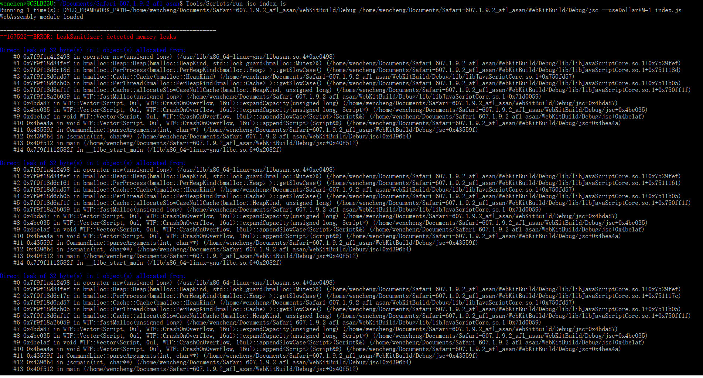
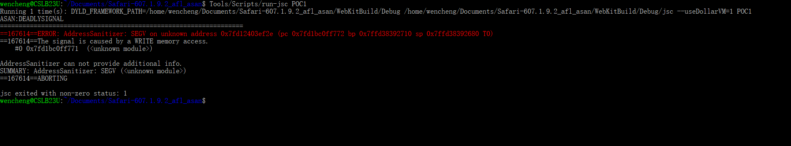

# Fuzz testing on JavaScriptCore and WebAssembly in WebKit

## 1. WebKit

### 1.1 About
WebKit is a browser engine used in Apple's Safari browser and other products.

WebKit is also the basis for the experimental browser included with the Amazon Kindle e-book reader, and for the default browser in Apple iOS, BlackBerry Browser in OS 6 and above, and Tizen mobile operating systems. WebKit's C++ application programming interface (API) provides a set of classes to display web content in windows, and implements browser features such as following links when clicked by the user, managing a back-forward list, and managing a history of pages recently visited.

WebKit's HTML and JavaScript code was originally a fork of the KHTML and KJS libraries from KDE, and has now been further developed by individuals from KDE, Apple, Google, Nokia, Bitstream, BlackBerry, Igalia, and others. macOS, Windows, Linux, and some other Unix-like operating systems are supported by the project. On April 3, 2013, Google announced that it had forked WebCore, a component of WebKit, to be used in future versions of Google Chrome and the Opera web browser, under the name Blink.

WebKit is available under a BSD-form license with the exception of the WebCore and JavaScriptCore components, which are available under the GNU Lesser General Public License. As of March 7, 2013, WebKit is a trademark of Apple, registered with the U.S. Patent and Trademark Office

### 1.2 JavaScriptCore

The JavaScriptCore Framework provides the ability to evaluate JavaScript programs from within Swift, Objective-C, and C-based apps. You can use also use JavaScriptCore to insert custom objects to the JavaScript environment.

### 1.3 WebAssembly

WebAssembly (abbreviated Wasm) is a binary instruction format for a stack-based virtual machine. Wasm is designed as a portable target for compilation of high-level languages like C/C++/Rust, enabling deployment on the web for client and server applications.

**Efficient and fast.**
The Wasm stack machine is designed to be encoded in a size- and load-time-efficient binary format. WebAssembly aims to execute at native speed by taking advantage of common hardware capabilities available on a wide range of platforms.

**Safe.**
WebAssembly describes a memory-safe, sandboxed execution environment that may even be implemented inside existing JavaScript virtual machines. When embedded in the web, WebAssembly will enforce the same-origin and permissions security policies of the browser.

**Open and debuggable.**
WebAssembly is designed to be pretty-printed in a textual format for debugging, testing, experimenting, optimizing, learning, teaching, and writing programs by hand. The textual format will be used when viewing the source of Wasm modules on the web.

**Part of the open web platform.**
WebAssembly is designed to maintain the versionless, feature-tested, and backwards-compatible nature of the web. WebAssembly modules will be able to call into and out of the JavaScript context and access browser functionality through the same Web APIs accessible from JavaScript. WebAssembly also supports non-web embeddings.

## 2. Deploy And Setup

### 2.1 Building WebKit

Building macOS Port
Install Xcode and its command line tools if you haven't done so already:

Install Xcode Get Xcode from https://developer.apple.com/downloads. To build WebKit for OS X, Xcode 5.1.1 or later is required. To build WebKit for iOS Simulator, Xcode 7 or later is required.
1. Install the Xcode Command Line Tools In Terminal, run the command: xcode-select --install
2. Run the following command to build a debug build with debugging symbols and assertions:

    Tools/Scripts/build-webkit --debug

For performance testing, and other purposes, use --release instead.

Using Xcode
You can open WebKit.xcworkspace to build and debug WebKit within Xcode.

If you don't use a custom build location in Xcode preferences, you have to update the workspace settings to use WebKitBuild directory. In menu bar, choose File > Workspace Settings, then click the Advanced button, select "Custom", "Relative to Workspace", and enter WebKitBuild for both Products and Intermediates.

Building iOS Port
The first time after you install a new Xcode, you will need to run the following command to enable Xcode to build command line tools for iOS Simulator:

    sudo Tools/Scripts/configure-xcode-for-ios-development

Without this step, you will see the error message: "target specifies product type ‘com.apple.product-type.tool’, but there’s no such product type for the ‘iphonesimulator’ platform." when building target JSCLLIntOffsetsExtractor of project JavaScriptCore.

Run the following command to build a debug build with debugging symbols and assertions for iOS:

    Tools/Scripts/build-webkit --debug --ios-simulator.

##### Building the GTK+ Port
##### For production builds:

    cmake -DPORT=GTK -DCMAKE_BUILD_TYPE=RelWithDebInfo -GNinja
    ninja
    sudo ninja install

##### For development builds:

    Tools/gtk/install-dependencies
    Tools/Scripts/update-webkitgtk-libs
    Tools/Scripts/build-webkit --gtk --debug

For more information on building WebKitGTK+, see the wiki page.

#### Building the WPE Port
For production builds:

    cmake -DPORT=WPE -DCMAKE_BUILD_TYPE=RelWithDebInfo -GNinja
    ninja
    sudo ninja install

#### For development builds:

Tools/wpe/install-dependencies
Tools/Scripts/update-webkitwpe-libs
Tools/Scripts/build-webkit --wpe --debug
Building Windows Port
For building WebKit on Windows, see the wiki page.

#### Running WebKit
With Safari and Other macOS Applications
Run the following command to launch Safari with your local build of WebKit:

    Tools/Scripts/run-safari --debug

The run-safari script sets the DYLD_FRAMEWORK_PATH environment variable to point to your build products, and then launches /Applications/Safari.app. DYLD_FRAMEWORK_PATH tells the system loader to prefer your build products over the frameworks installed in /System/Library/Frameworks.

To run other applications with your local build of WebKit, run the following command:

    Tools/Scripts/run-webkit-app <application-path>

#### iOS Simulator
Run the following command to launch iOS simulator with your local build of WebKit:

    run-safari --debug --ios-simulator

In both cases, if you have built release builds instead, use --release instead of --debug.

#### Linux Ports
If you have a development build, you can use the run-minibrowser script, e.g.:

    run-minibrowser --debug --wpe

Pass one of --gtk, --jsc-only, or --wpe to indicate the port to use.

### 2.2 Build Fuzzer

One way is to change the JSC file. Another way is to change WASM file.
You really need a driver to start the testing on WASM, see Fuzzing folder.

    cd WasmFuzz
    make
    cd llvm_mode && make
    cd .. && make && make install
    cd Fuzzing

    //driver in the Fuzzig folder
    ...

## 3. Data Data-Driven Seed Geneartion and Mutation

https://github.com/zhunki

### 3.1 Skyfire(Data-Driven Seed Generation for Fuzzing)

Programs that take highly structured files as input typically process input in stages: parsing, script checking, and application execution. Depth errors are usually hidden during the application execution phase, and it is very important to automatically generate test inputs to trigger them. The test input is generated by randomly or heuristically modifying the well-formed seed input based on the mutual fuzzy test. Most of the input was rejected during the early parsing phase. The difference is that the generated fuzzing generates input from specifications (eg, grammar). Perform a fuzzing test outside of the parsing phase. However, most inputs fail to pass language checks (for example, violations of semantic rules), which limits their ability to detect deep errors.

In this paper, the authors propose a novel data-driven seed generation method called Skyfire that uses knowledge from a large number of existing samples to generate evenly distributed seed inputs for fuzzy programs that process highly structured inputs. Skyfire takes the input corpus and grammar as input and consists of two steps. Skyfire's first step is to learn Probabilistic Context-Sensitive Syntax (PCSG) to specify grammatical features and semantic rules, and then the second step uses the learned PCSG to generate seed input. The collected samples and the input generated by Skyfire are used as seeds of the AFL to obscure several open source XSLT and XML engines (ie Sablotron, libxslt and libxml2). The results show that Skyfire can generate evenly distributed inputs, improving code coverage (ie 20% line coverage, 15% average functional coverage) and the vulnerability discovery capabilities of the fuzzer. They also used the input generated by Skyfire to blur the closed source JavaScript and Internet Explorer 11 rendering engine. A total of 19 new memory corruption errors (16 new ones) and 32 denial of service errors were discovered.

### 3.2 GramFuzz(Improved by zhunki, Integrated into AFL)

Fuzz testing is an automated black-box testing technique providing random data as input to a software system in the hope to find vulnerability. In order to be effective, the fuzzed input must be common enough to pass elementary consistency checks. Web Browser accepts JavaScript, CSS files as well as the html as input, which must be considered in fuzzing testing, while traditional fuzzing technology generates test cases using simple mutation strategies, ignoring the grammar and code structure. In this article, vulnerability patterns are summarized and a new fuzzing testing method are proposed based on grammar analysis of input data and mutation of code structure. Combining methods of generation and mutation, test cases will be more effective in the fuzzing testing of web browsers. Applied on the Mozilla and IE web browsers, it discovered a total of 36 new severe vulnerabilities(and thus became one of the top security bug bounty collectors within this period).

## 4. Common vulnerabilities

### 4.1 Memory Leak in Webkit

### 4.2 MInvalid Address Read in Webkit

